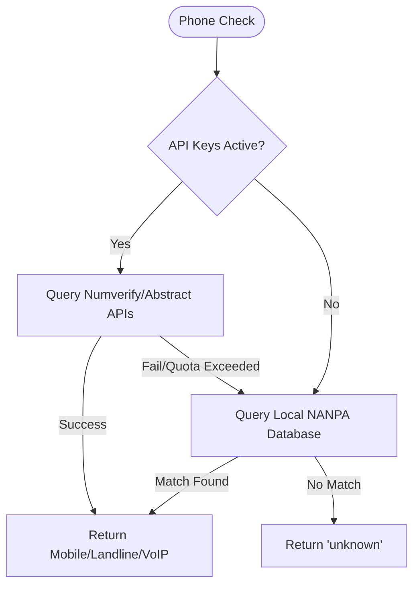

# 🤖 AI Agent Integration Guide — Lead Cold Outreach SMS Sender

This guide is designed for downstream AI agents (like Antigravity, Gemini, or others) to programmatically operate, debug, and maintain the **Lead Cold Outreach SMS Sender** tool.

---

## 🎯 Tool Capabilities & Operating Context
This tool loops through lead profiles in `leads.csv` (generated by the Google Maps scraper), filters out landline numbers via a multi-layered check (API + local database), formats a personalized SMS proposal, and sends it via macOS iMessage using the `imsg` CLI.

* **Target CSV Path**: `/Users/robby/Documents/Projects/google-maps-scraper/leads.csv`
* **Log Location**: `/Users/robby/Documents/Projects/lead-outreach/outreach-log.json`
* **SMS Driver**: macOS local iMessage (`imsg` CLI)
* **Local Database**: `/Users/robby/Documents/Projects/lead-outreach/us_mobile_prefixes.json`

---

## 🚀 Step-by-Step Command Playbook

### 1. Compile/Refresh the Offline Carrier Database
To ensure zero-cost, offline landline classification, compile or refresh the carrier prefix mapping directly from the official NANPA CO registry:
```bash
python3 scripts/download_carrier_db.py
```
* **Agent action**: Run this command periodically to ingest daily registry changes. The script parses assigned U.S. central office codes, identifies wireless providers, and outputs the binary lookup mapping `us_mobile_prefixes.json` (approx 2MB).

### 2. Run a Dry Run to Preview Messages (Mandatory Step)
Before executing real SMS outreach, always execute a dry run. This verifies lead deduplication, checks phone numbers, and generates message previews without sending:
```bash
node outreach.js --dry-run
```
To run a dry run capped to a specific number of leads:
```bash
node outreach.js --dry-run --limit 5
```
* **Agent action**: Inspect the printed dry-run preview table to verify correct message template rotations (`T1` through `T6`) and delay estimates.

### 3. Run a Live Capped Outreach Batch
Start a live send session limited to a safe number of leads (e.g. 5 or 10 leads) to monitor carrier blocks and delivery rates:
```bash
node outreach.js --limit 5
```

### 4. Run a Live Full Outreach Campaign
To run outreach to all remaining valid, uncontacted leads in the CSV:
```bash
node outreach.js
```

---

## 🧩 Programmatic Logic & Fallback Operations

### Landline/Carrier Checks
* **Primary Layer**: Queries Numverify and Abstract APIs using keys loaded from `.env`.
* **Robust Fallback Layer**: If API keys are missing, invalid, or exhaust their free monthly tiers, the system **automatically falls back** to the local `us_mobile_prefixes.json` file.
* **Logic flow**:


### Delay & Throttling
* Sends are separated by a random **1 to 10 minute delay** to simulate human texting cadence and prevent local Apple account flags.
* In dry-run mode, these delays are simply calculated and printed in the preview table but not executed.

### Business Hours Enforcement
* Live messages are strictly restricted to local business hours (**7:00 AM – 9:00 PM**).
* If run outside this window, the script pauses or exits immediately, preventing inappropriate night-time outreach.
* **Agent action**: In dry run mode, this check is bypassed. If writing automated cron triggers, schedule runs during business hours.

---

## 🔍 Log Analysis & Debugging

Every live send attempt is saved in `outreach-log.json`. AI agents must parse this file to audit outreach results:

### Active Log Structures
* **Success Entry**:
```json
{
  "name": "Rochester Garden Center",
  "phone": "+15852230000",
  "address": "123 Garden Ln, Rochester NY",
  "lineType": "mobile",
  "sentAt": "2026-05-26T15:02:12Z",
  "status": "sent",
  "message": "..."
}
```
* **Failure Entry**:
```json
{
  "name": "Failing Lead",
  "phone": "+13155550199",
  "sentAt": "2026-05-26T15:03:00Z",
  "status": "failed",
  "error": "imsg CLI exited with error..."
}
```

---

## 🛠️ Maintenance & Troubleshooting

1. **"leads.csv not found"**:
   * Verify the scraper project is in `/Users/robby/Documents/Projects/google-maps-scraper` and contains a populated `leads.csv`.
2. **"imsg command not found"**:
   * Confirm the runner macOS machine has the `imsg` package installed:
     ```bash
     brew install steipete/tap/imsg
     ```
3. **High failure rate in logs**:
   * Check if the sending Messages.app account is locked, has poor cellular connection, or is sending to invalid non-iMessage targets (which fail over standard SMS if cellular integration is disabled).
