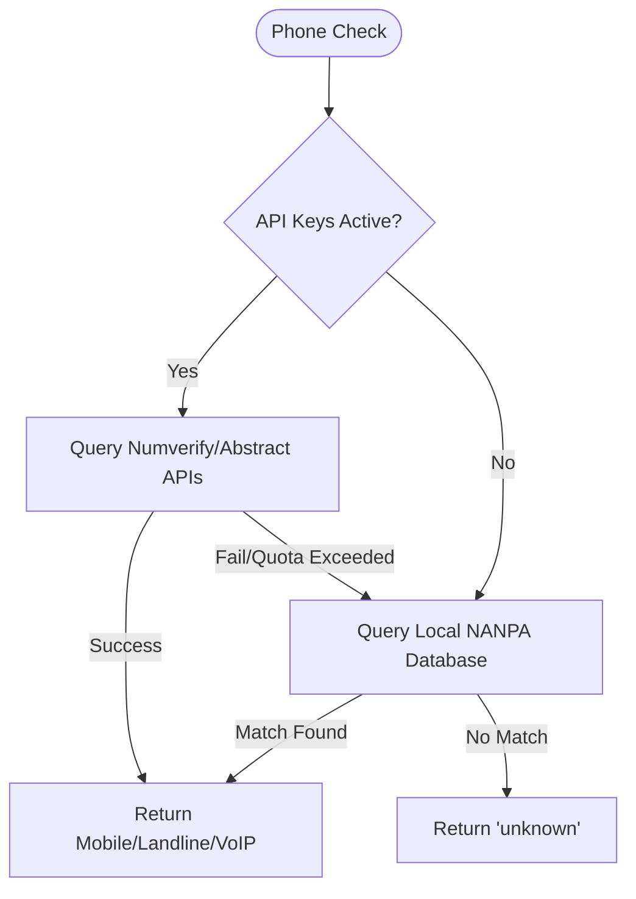

# 🤖 AI Agent Integration Guide — Lead Cold Outreach SMS Sender

This guide is designed for downstream AI agents (like Antigravity, Gemini, or others) to programmatically operate, debug, and maintain the **Lead Cold Outreach SMS Sender** tool.

---

## ⚠️ Read First
This tool sends unsolicited commercial SMS. Before running any live send, read the **"Responsible Use & Legal"** section of `README.md`. Every message carries a mandatory `Reply STOP to opt out.` suffix that cannot be disabled, and the human operator is solely responsible for compliance. Agents must not attempt to remove, bypass, or work around the opt-out suffix, the do-not-contact list, the sender-name requirement, or the business-hours window.

**Live sending is the human's decision.** An agent should default to dry runs and should only pass `--send` when explicitly instructed to do so for a specific run.

---

## 🎯 Tool Capabilities & Operating Context
This tool loops through lead profiles in a leads CSV, filters out likely landline numbers via a multi-layered check (API + local database), formats a personalized SMS proposal, and sends it via macOS iMessage using the `imsg` CLI.

* **Target CSV Path**: `--leads <file>`, else `$LEADS_CSV`, else `./leads.csv` relative to the working directory
* **Log Location**: `outreach-log.json` in the project directory
* **Suppression List**: `--suppress <file>`, else `do-not-contact.txt` in the same directory as the leads CSV
* **SMS Driver**: macOS local iMessage (`imsg` CLI)
* **Local Database**: `us_mobile_prefixes.json` in the project directory
* **Sender Name**: `--sender "Name"`, else `$SENDER_NAME`. Required for a live send; dry runs show a `<YOUR NAME>` placeholder.

---

## 🚀 Step-by-Step Command Playbook

### 1. Compile/Refresh the Offline Carrier Database
To ensure zero-cost, offline landline classification, compile or refresh the carrier prefix mapping directly from the official NANPA CO registry:
```bash
python3 scripts/download_carrier_db.py
```
* **Agent action**: Run this command periodically to ingest daily registry changes. The script parses assigned U.S. central office codes, identifies wireless providers, and outputs the binary lookup mapping `us_mobile_prefixes.json` (approx 2MB).

### 2. Run a Dry Run to Preview Messages (the default)
**Dry run is the default mode.** Running with no flags sends nothing. This verifies lead deduplication, suppression-list filtering, phone checks, and message previews:
```bash
node outreach.js
```
To preview from a specific CSV, capped to a number of leads:
```bash
node outreach.js --leads ./leads.csv --limit 5
```
* **Agent action**: Inspect the printed dry-run preview table to verify correct message template rotations (`T1` through `T6`) and delay estimates, and confirm every preview ends with `Reply STOP to opt out.`

### 3. Run a Live Capped Outreach Batch
Live sending requires the explicit `--send` flag plus a sender name. Start limited to a small number of leads to monitor delivery:
```bash
node outreach.js --send --sender "Your Name" --limit 5
```

### 4. Run a Live Full Outreach Campaign
To run outreach to all remaining valid, uncontacted, non-suppressed leads in the CSV:
```bash
node outreach.js --send --sender "Your Name"
```

---

## 🧩 Programmatic Logic & Fallback Operations

### Landline/Carrier Checks
* **Primary Layer**: Queries Numverify and Abstract APIs using keys loaded from `.env`.
* **Robust Fallback Layer**: If API keys are missing, invalid, or exhaust their free monthly tiers, the system **automatically falls back** to the local `us_mobile_prefixes.json` file.
* **Logic flow**:

```mermaid
graph TD
    Start([Phone Check]) --> CheckKeys{API Keys Active?}
    CheckKeys -- Yes --> QueryAPIs[Query Numverify/Abstract APIs]
    QueryAPIs -- Success --> ReturnType[Return Mobile/Landline/VoIP]
    QueryAPIs -- Fail/Quota Exceeded --> OfflineCheck
    CheckKeys -- No --> OfflineCheck[Query Local NANPA Database]
    OfflineCheck -- Match Found --> ReturnType
    OfflineCheck -- No Match --> Unknown[Return 'unknown']
```

### Delay & Throttling
* Sends are separated by a random **1 to 5 minute delay** to keep outreach volume human-scale and avoid overwhelming recipients with a rapid blast. The gap is a deliberate ceiling on how many people this tool can reach in a day.
* In dry-run mode, these delays are simply calculated and printed in the preview table but not executed.
* **Agent action**: Do not shorten, remove, or parallelize the delay.

### Opt-Out & Suppression
* `buildMessage()` appends `Reply STOP to opt out.` at a single return point. There is no flag to disable it and no template can omit it.
* Numbers listed in the do-not-contact file are filtered out of the send queue alongside already-contacted numbers, and the suppressed count is printed each run.
* **Agent action**: When a recipient replies STOP or asks not to be contacted, add their number to `do-not-contact.txt` before the next run. The tool does not read replies.

### Business Hours Enforcement
* Live messages are restricted to local business hours, defaulting to **9:00 AM – 6:00 PM**, configurable with `--hours 9-18` or `BUSINESS_HOURS_START` / `BUSINESS_HOURS_END`.
* If run outside this window, the script exits immediately, and the window is re-checked between every send so a long run pauses rather than spilling into the evening.
* **Agent action**: In dry run mode, this check is bypassed. If writing automated cron triggers, schedule runs during business hours.

### Preflight Checks
* A live run verifies `imsg` is on `PATH` before the send loop and aborts with the Homebrew install instruction if it is missing, rather than failing on every lead while still sleeping between each.
* A live run without a sender name exits with an error, because recipients must be able to identify who is messaging them.

---

## 🔍 Log Analysis & Debugging

Every live send attempt is saved in `outreach-log.json`. AI agents must parse this file to audit outreach results.

**`outreach-log.json` and the leads CSV contain third-party personal data.** Do not commit them, paste them into issues or chats, or include their contents in reports. Both are gitignored.

### Active Log Structures
* **Success Entry**:
```json
{
  "name": "Example Garden Center",
  "phone": "+15550100101",
  "address": "123 Example Ln, Springfield IL",
  "lineType": "mobile",
  "sentAt": "2026-05-26T15:02:12Z",
  "status": "sent",
  "message": "..."
}
```
* **Failure Entry**:
```json
{
  "name": "Failing Lead",
  "phone": "+15550100199",
  "sentAt": "2026-05-26T15:03:00Z",
  "status": "failed",
  "error": "imsg CLI exited with error..."
}
```

---

## 🛠️ Maintenance & Troubleshooting

1. **"Leads CSV not found"**:
   * The script resolves the CSV from `--leads <file>`, else `$LEADS_CSV`, else `./leads.csv` relative to the current working directory. Verify the file exists at the resolved path printed in the error, and that it has `Name`, `Phone`, and `Address` headers (see `leads.example.csv`).
2. **"imsg command not found"**:
   * Confirm the runner macOS machine has the `imsg` package installed:
     ```bash
     brew install steipete/tap/imsg
     ```
3. **High failure rate in logs**:
   * Check if the sending Messages.app account is locked, has poor cellular connection, or is sending to invalid non-iMessage targets (which fail over standard SMS if cellular integration is disabled).
